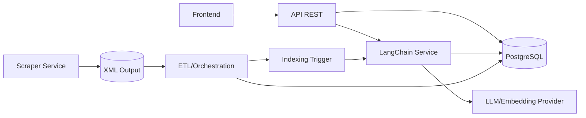
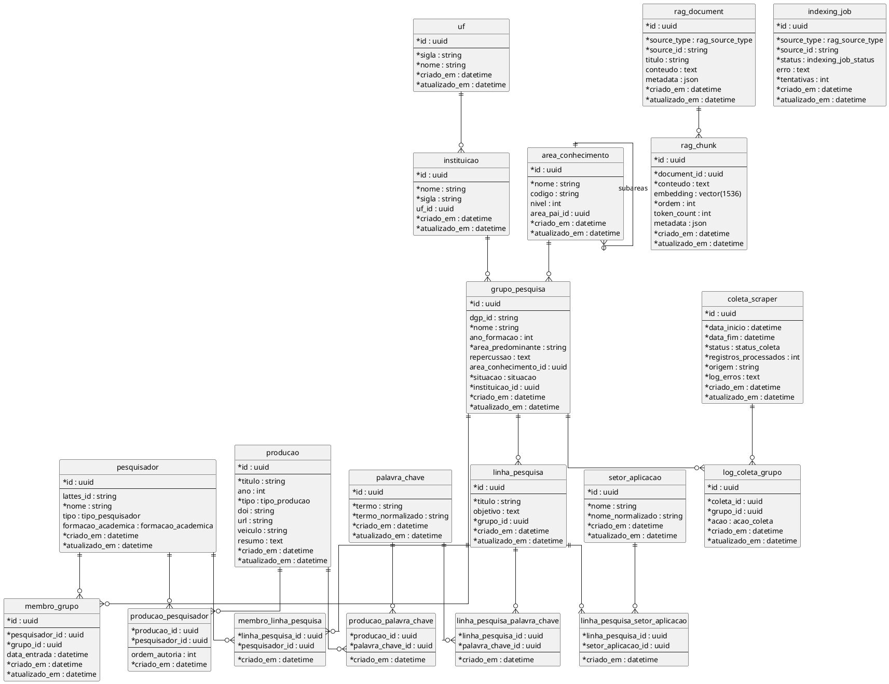

# Backend Specification

## 1. Contexto

Este documento consolida, de forma incremental, o planejamento técnico do backend do projeto de TCC: uma API baseada em microserviços e Inteligência Artificial para extração, estruturação, disponibilização e recuperação semântica de dados de grupos de pesquisa do CNPq/DGP.

O escopo deste documento está restrito a:

- Web Scraper e pipeline de ETL.
- API REST e microservices.
- LangChain, embeddings, busca semântica e RAG.

## 2. Objetivo Técnico Inicial

Planejar uma arquitetura backend capaz de:

- Coletar dados públicos relacionados a grupos de pesquisa.
- Transformar dados não estruturados ou semi-estruturados em modelos consistentes.
- Disponibilizar dados por API REST.
- Isolar responsabilidades em serviços independentes.
- Suportar busca semântica e respostas aumentadas por recuperação de contexto.
- Servir como artefato prático alinhado aos objetivos científicos do anteprojeto.

## 3. Escopo Inicial

### 3.1 Web Scraper

O primeiro recorte do scraper será a coleta de uma amostra controlada de grupos de pesquisa registrados no DGP/CNPq, sem restringir inicialmente por instituição. O objetivo desta etapa é validar a viabilidade técnica da coleta, transformação posterior e disponibilização dos dados.

Fonte inicial:

- Páginas públicas do DGP/CNPq via web scraping.

Formato inicial de saída da coleta:

- XML coletado a partir do DGP/CNPq.
- O XML será enviado posteriormente para a etapa de ETL.

Fontes futuras previstas:

- OpenAlex.
- DOI/Crossref ou APIs relacionadas a DOI.
- ORCID, caso seja tecnicamente e metodologicamente adequado.

O scraper deverá ser tratado como serviço independente. Ele não deve concentrar a responsabilidade completa de ETL, pois a transformação e orquestração de dados serão planejadas em uma camada própria.

Acionamento inicial:

- A coleta será iniciada por agendamento, com periodicidade inicial prevista de uma vez por dia.
- A arquitetura deve permitir evolução futura para fila/job, caso seja necessário desacoplar melhor a coleta, reprocessamento ou escalabilidade.

### 3.1.1 ETL e Orquestração

O ETL será planejado como responsabilidade separada do scraper. Tecnologias candidatas:

- Apache Hop.
- Apache Airflow.
- Airbyte.

Responsabilidades esperadas do ETL:

- Limpeza de dados coletados.
- Padronização de campos.
- Normalização de entidades.
- Controle de duplicidade.
- Registro de qualidade dos dados.
- Carga no banco transacional e/ou nas tabelas de indexação semântica.

### 3.2 API REST e Microservices

A API REST terá inicialmente um frontend único como consumidor principal. A arquitetura deve, no entanto, preservar princípios de interoperabilidade para que o backend possa futuramente atender portais ou aplicações externas.

Os serviços deverão ser separados de forma independente, evitando dependências diretas entre módulos. A comunicação entre serviços deve ocorrer por contratos explícitos, banco de dados compartilhado quando justificável ou mensageria/orquestração, conforme definido nas próximas etapas.

Escopo inicial da API:

- Expor dados estruturados de grupos de pesquisa.
- Expor dados estruturados de pesquisadores.
- Expor dados estruturados de produções acadêmicas.
- Permitir consulta por áreas e linhas de pesquisa.
- Servir dados para o frontend inicial.
- Encaminhar consultas semânticas ao serviço LangChain quando necessário.

### 3.3 LangChain e RAG

O serviço LangChain será responsável pela camada de busca semântica e RAG. O MVP deve responder perguntas relacionadas a áreas e linhas de pesquisa dos grupos registrados.

Exemplo de pergunta-alvo:

> Quais grupos fazem trabalhos na área de X?

A abordagem inicial considerada é usar o mesmo PostgreSQL da API, mas com tabelas separadas para RAG/embeddings. Essa decisão busca reduzir complexidade operacional sem misturar os dados transacionais principais com os dados de indexação semântica.

Ponto técnico em aberto:

- Definir como os embeddings serão gerados após inserções ou atualizações de dados no banco transacional.

## 4. Requisitos

### 4.1 Requisitos Funcionais

- RF01: O sistema deve coletar dados públicos de grupos de pesquisa a partir do DGP/CNPq.
- RF02: O sistema deve persistir dados estruturados de grupos de pesquisa em banco relacional.
- RF03: O sistema deve expor endpoints REST para consulta de grupos de pesquisa.
- RF04: O sistema deve permitir consultas por áreas de pesquisa.
- RF05: O sistema deve permitir consultas por linhas de pesquisa.
- RF06: O sistema deve oferecer busca semântica sobre áreas e linhas de pesquisa.
- RF07: O sistema deve permitir que o serviço LangChain recupere trechos relevantes para responder perguntas sobre grupos de pesquisa.
- RF08: O pipeline de dados deve registrar informações que permitam avaliar qualidade, completude e duplicidade dos dados.
- RF09: O sistema deve coletar inicialmente dados em formato XML.
- RF10: O sistema deve permitir execução agendada do scraper.
- RF11: O sistema deve persistir e expor dados de pesquisadores vinculados aos grupos de pesquisa.
- RF12: O sistema deve persistir e expor dados de produções acadêmicas relacionadas.
- RF13: O sistema deve permitir geração ou atualização de embeddings a partir de dados inseridos ou alterados no banco.

### 4.2 Requisitos Não Funcionais

- RNF01: Os serviços devem ser independentes, com possibilidade de deploy separado.
- RNF02: A falha de um serviço não deve comprometer diretamente a disponibilidade dos demais serviços.
- RNF03: A API deve ter tempo de resposta mensurável para consultas REST.
- RNF04: O scraper deve respeitar limites técnicos e éticos de coleta automatizada.
- RNF05: O sistema deve permitir medição de qualidade dos dados coletados.
- RNF06: A arquitetura deve permitir evolução incremental para novas fontes externas, como OpenAlex, DOI e ORCID.
- RNF07: Os dados transacionais e os dados de RAG devem permanecer logicamente separados, mesmo quando armazenados no mesmo PostgreSQL.

### 4.3 Regras de Negócio

- RN01: O recorte inicial não será limitado a uma instituição específica.
- RN02: A coleta inicial será feita a partir do DGP/CNPq.
- RN03: APIs externas serão adicionadas em etapas posteriores, após validação do fluxo inicial de scraping.
- RN04: O LangChain deve responder apenas com base em dados disponíveis no sistema ou contexto recuperado.
- RN05: A busca semântica inicial será limitada a temas, áreas e linhas de pesquisa dos grupos.
- RN06: O scraper deve gerar XML como artefato inicial de coleta.
- RN07: O ETL será responsável por transformar XML em dados estruturados.
- RN08: Pesquisadores e produções acadêmicas fazem parte do escopo do MVP.

## 5. Arquitetura

Arquitetura inicial em discussão:

Observações:

- O scraper coleta dados em XML.
- O ETL transforma, limpa e carrega dados no banco.
- A API expõe os dados estruturados.
- O LangChain consulta tabelas de RAG/embeddings e usa o LLM apenas quando necessário.
- A geração de embeddings após carga/atualização dos dados será refinada.

## 6. Modelagem de Dados

Decisão inicial:

- Os dados principais da aplicação ficarão em tabelas transacionais.
- Os dados de RAG ficarão em tabelas separadas, ainda que no mesmo PostgreSQL.
- As tabelas de RAG devem referenciar entidades principais de forma flexível, por exemplo por `sourceType` e `sourceId`.

Entidades mínimas candidatas para o MVP:

- `GrupoPesquisa`.
- `Instituicao`.
- `LinhaPesquisa`.
- `AreaConhecimento`.
- `PalavraChave`.
- `Pesquisador`.
- `Producao`.
- `ColetaScraper`.
- `LogColeta`.
- `RagDocument`.
- `RagChunk`.

### 6.1 Foco Atual

O planejamento imediato será concentrado na definição das tabelas do banco e na construção da API REST. Scraper, ETL e LangChain serão considerados apenas como consumidores/produtores futuros dos dados, sem detalhamento operacional nesta etapa.

Pontos a definir:

- Entidades transacionais principais.
- Campos mínimos de cada entidade.
- Relacionamentos e cardinalidades.
- Tabelas auxiliares de classificação, como áreas de conhecimento e palavras-chave.
- Estratégia para entidades externas ou identificadores vindos do DGP/CNPq.
- Endpoints REST iniciais.
- Filtros, paginação, ordenação e formato de resposta.

### 6.2 Estado Atual do Schema

Tabelas/modelos atualmente presentes no schema Prisma:

- `Instituicao`.
- `Uf`.
- `GrupoPesquisa`.
- `LinhaPesquisa`.
- `Pesquisador`.
- `MembroGrupo`.
- `MembroLinhaPesquisa`.
- `AreaConhecimento`.
- `PalavraChave`.
- `SetorAplicacao`.
- `LinhaPesquisaPalavraChave`.
- `LinhaPesquisaSetorAplicacao`.
- `Producao`.
- `ProducaoPesquisador`.
- `ProducaoPalavraChave`.
- `RagDocument`.
- `RagChunk`.
- `IndexingJob`.
- `ColetaScraper`.
- `LogColetaGrupo`.

Enums atualmente presentes:

- `Situacao`.
- `TipoPesquisador`.
- `FormacaoAcademica`.
- `TipoProducao`.
- `RagSourceType`.
- `IndexingJobStatus`.
- `StatusColeta`.
- `AcaoColeta`.

Tabelas/modelos adicionados para fechar o MVP:

- `AreaConhecimento`.
- `PalavraChave`.
- `SetorAplicacao`.
- `Producao`.
- `MembroLinhaPesquisa`.
- `LinhaPesquisaPalavraChave`.
- `LinhaPesquisaSetorAplicacao`.
- `ProducaoPalavraChave`.
- `ProducaoPesquisador`.
- `RagDocument`.
- `RagChunk`.
- `IndexingJob`.

Enums adicionados:

- `TipoProducao`.
- `TipoPesquisador`.
- `FormacaoAcademica`.
- `RagSourceType`.
- `IndexingJobStatus`.

Correções e complementos aplicados:

- `GrupoPesquisa` recebeu `dgpId` para rastrear identificador externo do DGP/CNPq.
- `GrupoPesquisa` recebeu `repercussao`.
- `Pesquisador` recebeu `lattesId`.
- `Pesquisador.name` foi corrigido para `Pesquisador.nome`.
- `Pesquisador` recebeu `tipo`, com valores técnico, estudante, pesquisador e colaborador estrangeiro.
- `Pesquisador` recebeu `formacaoAcademica`, com valores graduação, especialização, mestrado e doutorado.
- `Pesquisador` não possui `email` no modelo atual.
- `Uf` foi criada como tabela própria.
- `Instituicao.uf` passou a ser uma relação opcional com `Uf`.
- `GrupoPesquisa` passou a ter vínculo opcional com `AreaConhecimento`.
- `MembroGrupo` recebeu `dataEntrada` para registrar quando o pesquisador entrou no grupo.
- `LinhaPesquisa` passou a possuir membros por meio de `MembroLinhaPesquisa`.
- `LinhaPesquisa` passou a possuir setores de aplicação por meio de `SetorAplicacao` e `LinhaPesquisaSetorAplicacao`.
- `Producao` foi modelada com vínculo N:N com `Pesquisador`.
- `GrupoPesquisa` não possui relação direta com `Producao` no modelo atual.
- `GrupoPesquisa` não possui palavras-chave no modelo atual.
- `Pesquisador` não possui palavras-chave no modelo atual.
- `PalavraChave` foi modelada como entidade reutilizável, mas associada apenas a linhas de pesquisa e produções.
- Projetos de pesquisa foram reconhecidos como possibilidade futura, mas ficaram fora do modelo atual.
- As tabelas de RAG foram separadas das tabelas transacionais.
- `IndexingJob` foi incluída para suportar geração assíncrona de embeddings após inserções ou atualizações.
- A nomenclatura mantém camelCase no Prisma Client e snake_case no banco via `@map`/`@@map`.

### 6.3 Estado Atual da API REST

Módulos REST existentes:

- `grupos-pesquisa`.
- `instituicao`.
- `linha-pesquisa`.
- `pesquisadores`.
- `producoes`.

Endpoints scaffold existentes por recurso:

- `POST /recurso`.
- `GET /recurso`.
- `GET /recurso/:id`.
- `PATCH /recurso/:id`.
- `DELETE /recurso/:id`.

Observações:

- `findAll` de grupos, instituições, linhas e pesquisadores já consulta Prisma.
- `create`, `findOne`, `update` e `remove` ainda são placeholders.
- DTOs de criação/atualização estão vazios.
- Algumas rotas tratam `id` como número, mas o schema usa UUID string.
- O recurso `producoes` existe no código e possui modelo correspondente no Prisma, mas o service ainda está em scaffold.
- Ainda não há validação global de DTOs, paginação, filtros, ordenação ou padronização de resposta.

## 7. Diagramas

### 7.1 DER Atual

## 8. Considerações Acadêmicas

Métricas iniciais consideradas para avaliação do artefato:

- Quantidade de valores nulos por entidade/campo.
- Tempo médio de resposta da API.
- Qualidade das respostas do LangChain/RAG.
- Identificação e análise de dados duplicados.
- Completude dos dados após coleta e ETL.

A avaliação inicial das respostas do LangChain será manual, verificando:

- Se a resposta não inventa dados.
- Se os grupos retornados são compatíveis com a pergunta.
- Se a resposta está apoiada em dados efetivamente coletados.
- Se a recuperação usa corretamente áreas e linhas de pesquisa.
