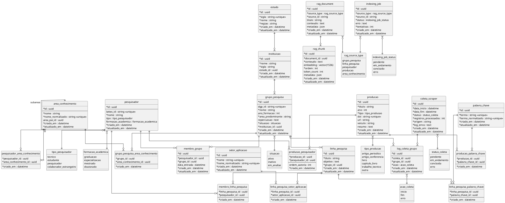

# Modelagem DER

Diagrama entidade-relacionamento derivado do schema Prisma em `apps/api/prisma/schema.prisma`.

```plantuml
@startuml
hide circle
skinparam linetype ortho
skinparam classAttributeIconSize 0

entity "estado" as Estado {
  * id : uuid
  --
  * sigla : string <<unique>>
  * nome : string
  * regiao : string
  * criado_em : datetime
  * atualizado_em : datetime
}

entity "instituicao" as Instituicao {
  * id : uuid
  --
  * nome : string
  * sigla : string
  estado_id : uuid
  * criado_em : datetime
  * atualizado_em : datetime
}

entity "area_conhecimento" as AreaConhecimento {
  * id : uuid
  --
  * nome : string
  * nome_normalizado : string <<unique>>
  area_pai_id : uuid
  * criado_em : datetime
  * atualizado_em : datetime
}

entity "grupo_pesquisa" as GrupoPesquisa {
  * id : uuid
  --
  dgp_id : string <<unique>>
  * nome : string
  ano_formacao : int
  * area_predominante : string
  repercussao : text
  * situacao : situacao
  * instituicao_id : uuid
  * criado_em : datetime
  * atualizado_em : datetime
}

entity "linha_pesquisa" as LinhaPesquisa {
  * id : uuid
  --
  * titulo : string
  objetivo : text
  * grupo_id : uuid
  * criado_em : datetime
  * atualizado_em : datetime
}

entity "pesquisador" as Pesquisador {
  * id : uuid
  --
  lattes_id : string <<unique>>
  * nome : string
  tipo : tipo_pesquisador
  formacao_academica : formacao_academica
  * criado_em : datetime
  * atualizado_em : datetime
}

entity "grupo_pesquisa_area_conhecimento" as GrupoPesquisaAreaConhecimento {
  * grupo_id : uuid
  * area_conhecimento_id : uuid
  --
  * criado_em : datetime
}

entity "pesquisador_area_conhecimento" as PesquisadorAreaConhecimento {
  * pesquisador_id : uuid
  * area_conhecimento_id : uuid
  --
  * criado_em : datetime
}

entity "membro_grupo" as MembroGrupo {
  * id : uuid
  --
  * pesquisador_id : uuid
  * grupo_id : uuid
  data_entrada : datetime
  * criado_em : datetime
  * atualizado_em : datetime
}

entity "membro_linha_pesquisa" as MembroLinhaPesquisa {
  * linha_pesquisa_id : uuid
  * pesquisador_id : uuid
  --
  * criado_em : datetime
}

entity "palavra_chave" as PalavraChave {
  * id : uuid
  --
  * termo : string <<unique>>
  * termo_normalizado : string <<unique>>
  * criado_em : datetime
  * atualizado_em : datetime
}

entity "setor_aplicacao" as SetorAplicacao {
  * id : uuid
  --
  * nome : string <<unique>>
  * nome_normalizado : string <<unique>>
  * criado_em : datetime
  * atualizado_em : datetime
}

entity "linha_pesquisa_palavra_chave" as LinhaPesquisaPalavraChave {
  * linha_pesquisa_id : uuid
  * palavra_chave_id : uuid
  --
  * criado_em : datetime
}

entity "linha_pesquisa_setor_aplicacao" as LinhaPesquisaSetorAplicacao {
  * linha_pesquisa_id : uuid
  * setor_aplicacao_id : uuid
  --
  * criado_em : datetime
}

entity "producao" as Producao {
  * id : uuid
  --
  * titulo : string
  ano : int
  * tipo : tipo_producao
  doi : string <<unique>>
  url : string
  veiculo : string
  resumo : text
  * criado_em : datetime
  * atualizado_em : datetime
}

entity "producao_pesquisador" as ProducaoPesquisador {
  * producao_id : uuid
  * pesquisador_id : uuid
  --
  ordem_autoria : int
  * criado_em : datetime
}

entity "producao_palavra_chave" as ProducaoPalavraChave {
  * producao_id : uuid
  * palavra_chave_id : uuid
  --
  * criado_em : datetime
}

entity "rag_document" as RagDocument {
  * id : uuid
  --
  * source_type : rag_source_type
  * source_id : string
  titulo : string
  conteudo : text
  metadata : json
  * criado_em : datetime
  * atualizado_em : datetime
}

entity "rag_chunk" as RagChunk {
  * id : uuid
  --
  * document_id : uuid
  * conteudo : text
  embedding : vector(1536)
  * ordem : int
  token_count : int
  metadata : json
  * criado_em : datetime
  * atualizado_em : datetime
}

entity "indexing_job" as IndexingJob {
  * id : uuid
  --
  * source_type : rag_source_type
  * source_id : string
  * status : indexing_job_status
  erro : text
  * tentativas : int
  * criado_em : datetime
  * atualizado_em : datetime
}

entity "coleta_scraper" as ColetaScraper {
  * id : uuid
  --
  * data_inicio : datetime
  * data_fim : datetime
  * status : status_coleta
  * registros_processados : int
  * origem : string
  * log_erros : text
  * criado_em : datetime
  * atualizado_em : datetime
}

entity "log_coleta_grupo" as LogColetaGrupo {
  * id : uuid
  --
  * coleta_id : uuid
  * grupo_id : uuid
  * acao : acao_coleta
  * criado_em : datetime
  * atualizado_em : datetime
}

enum "situacao" as Situacao {
  ativo
  inativo
  em_analise
}

enum "tipo_pesquisador" as TipoPesquisador {
  tecnico
  estudante
  pesquisador
  colaborador_estrangeiro
}

enum "formacao_academica" as FormacaoAcademica {
  graduacao
  especializacao
  mestrado
  doutorado
}

enum "tipo_producao" as TipoProducao {
  artigo_periodico
  artigo_conferencia
  livro
  capitulo_livro
  trabalho_tecnico
  outra
}

enum "rag_source_type" as RagSourceType {
  grupo_pesquisa
  linha_pesquisa
  pesquisador
  producao
  area_conhecimento
}

enum "indexing_job_status" as IndexingJobStatus {
  pendente
  em_andamento
  concluido
  erro
}

enum "status_coleta" as StatusColeta {
  pendente
  em_andamento
  concluida
  erro
}

enum "acao_coleta" as AcaoColeta {
  inicio
  fim
  erro
}

Estado ||--o{ Instituicao
Instituicao ||--o{ GrupoPesquisa
GrupoPesquisa ||--o{ GrupoPesquisaAreaConhecimento
AreaConhecimento ||--o{ GrupoPesquisaAreaConhecimento
Pesquisador ||--o{ PesquisadorAreaConhecimento
AreaConhecimento ||--o{ PesquisadorAreaConhecimento
AreaConhecimento ||--o{ AreaConhecimento : subareas
GrupoPesquisa ||--o{ LinhaPesquisa
GrupoPesquisa ||--o{ MembroGrupo
Pesquisador ||--o{ MembroGrupo
LinhaPesquisa ||--o{ MembroLinhaPesquisa
Pesquisador ||--o{ MembroLinhaPesquisa
LinhaPesquisa ||--o{ LinhaPesquisaPalavraChave
PalavraChave ||--o{ LinhaPesquisaPalavraChave
LinhaPesquisa ||--o{ LinhaPesquisaSetorAplicacao
SetorAplicacao ||--o{ LinhaPesquisaSetorAplicacao
Producao ||--o{ ProducaoPesquisador
Pesquisador ||--o{ ProducaoPesquisador
Producao ||--o{ ProducaoPalavraChave
PalavraChave ||--o{ ProducaoPalavraChave
RagDocument ||--o{ RagChunk
ColetaScraper ||--o{ LogColetaGrupo
GrupoPesquisa ||--o{ LogColetaGrupo

GrupoPesquisa }o--|| Situacao
Pesquisador }o--|| TipoPesquisador
Pesquisador }o--|| FormacaoAcademica
Producao }o--|| TipoProducao
RagDocument }o--|| RagSourceType
IndexingJob }o--|| RagSourceType
IndexingJob }o--|| IndexingJobStatus
ColetaScraper }o--|| StatusColeta
LogColetaGrupo }o--|| AcaoColeta
@enduml
```
